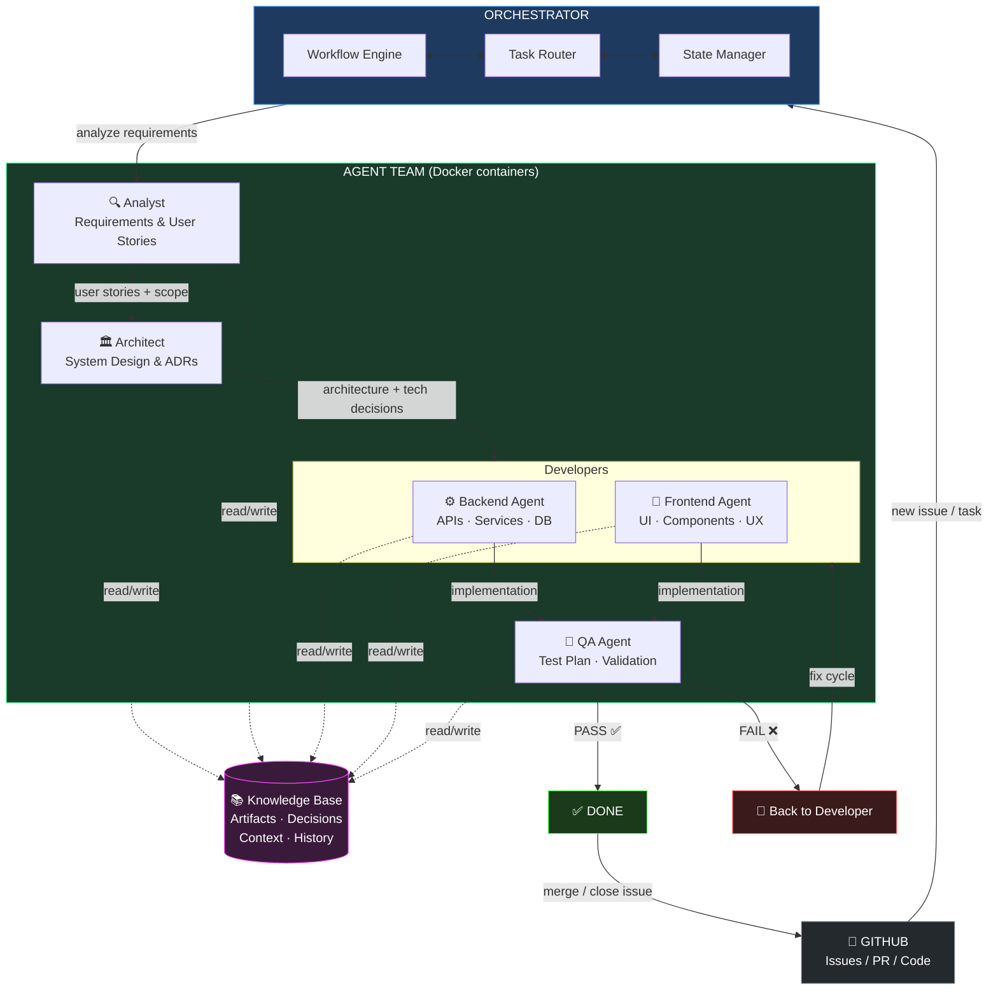
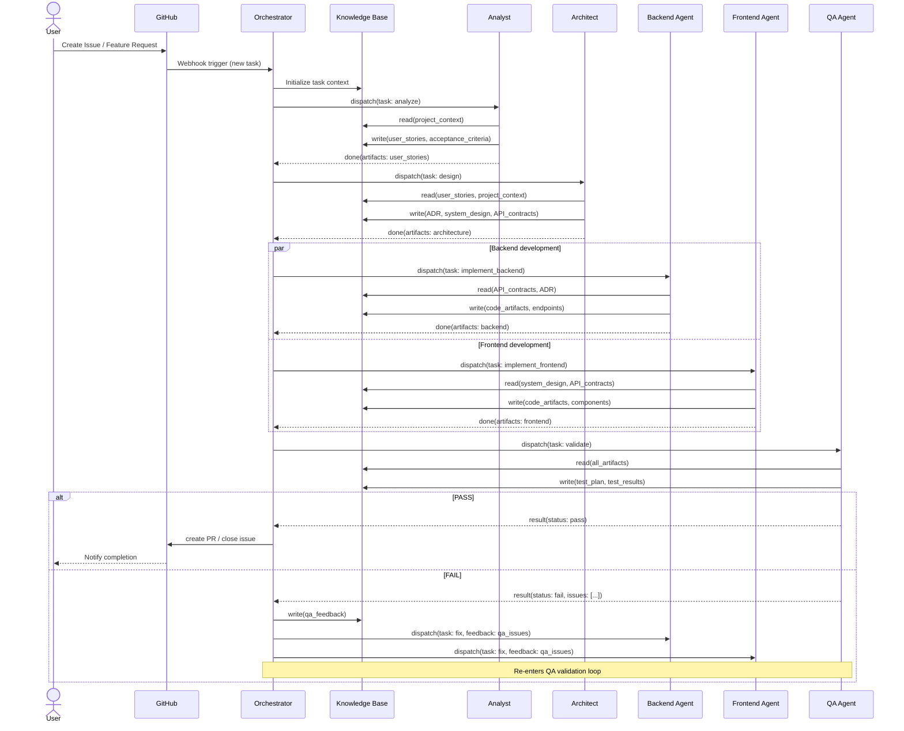
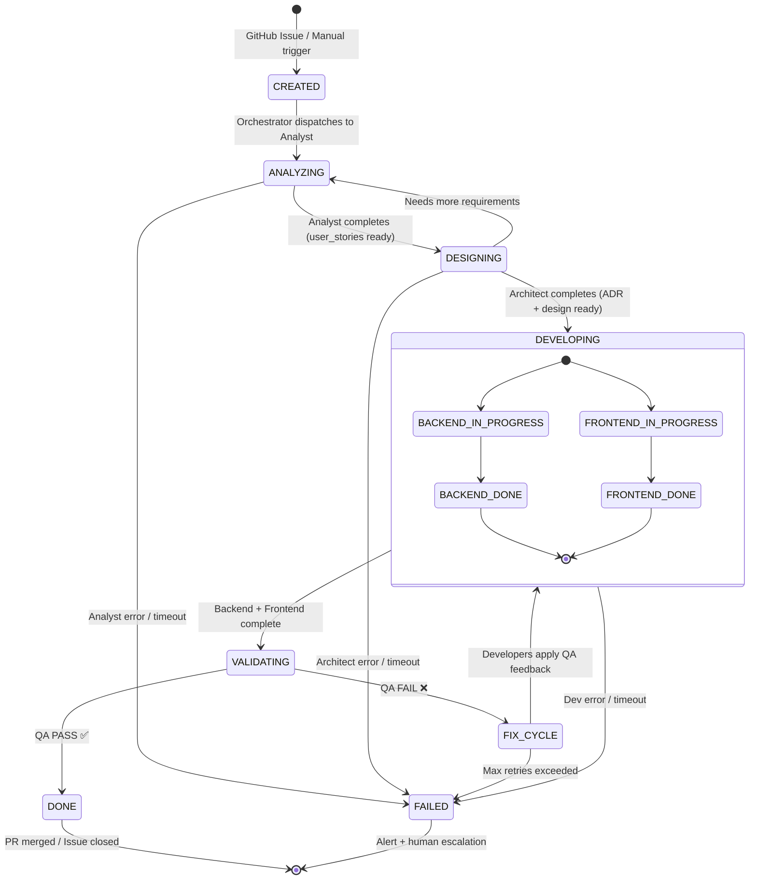
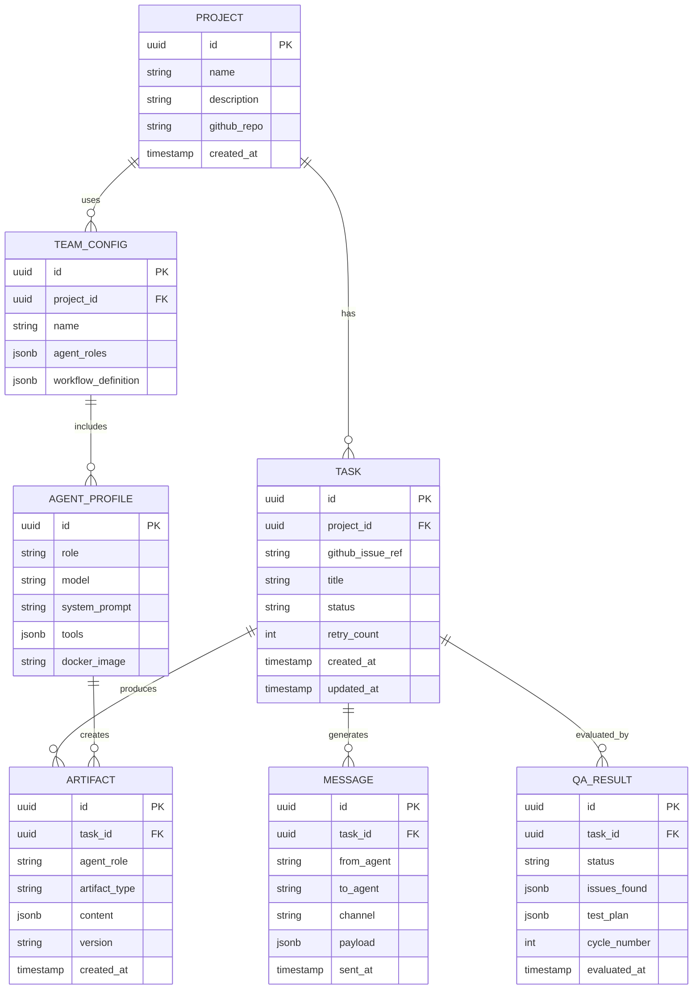

# Agentic Factory

Plataforma reutilizable para orquestar equipos de agentes AI en proyectos de software.
Define equipos completos por configuración YAML, ejecuta flujos de trabajo colaborativos
entre agentes especializados y mantiene una base de conocimiento compartida entre ellos.

---

## Tabla de contenidos

1. [Visión general](#visión-general)
2. [Arquitectura del sistema](#arquitectura-del-sistema)
   - [Flujo principal](#flujo-principal)
   - [Secuencia de ejecución](#secuencia-de-ejecución)
   - [Máquina de estados](#máquina-de-estados)
   - [Modelo de datos](#modelo-de-datos)
3. [Diseño LLM-agnóstico](#diseño-llm-agnóstico)
4. [Agentes del equipo](#agentes-del-equipo)
5. [Flujo de trabajo](#flujo-de-trabajo)
6. [Estructura del repositorio](#estructura-del-repositorio)
7. [Configuración de equipos](#configuración-de-equipos)
8. [Directorio de lineamientos](#directorio-de-lineamientos)
9. [Inicio rápido](#inicio-rápido)
10. [Agregar un nuevo proveedor LLM](#agregar-un-nuevo-proveedor-llm)
11. [Decisiones de arquitectura](#decisiones-de-arquitectura)

---

## Visión general

**Agentic Factory** orquesta un equipo de agentes AI — cada uno con un rol definido —
que colaboran para resolver tareas de desarrollo de software de extremo a extremo:
desde la recepción de un issue en GitHub hasta el PR listo para revisión humana.

Principios centrales:

| Principio | Descripción |
|-----------|-------------|
| **LLM-agnóstico** | Anthropic, OpenAI, Ollama y Gemini son intercambiables por config. Agregar un proveedor nuevo no toca código existente. |
| **Config-driven** | El equipo, los modelos, el flujo y las políticas de reintento se definen en YAML. |
| **Un container por agente** | Cada rol corre en su propio Docker container — aislamiento, escalabilidad independiente y distintas dependencias por perfil. |
| **Base de conocimiento compartida** | Los artefactos producidos por cada agente son accesibles por los siguientes. No hay transfer manual de contexto. |
| **Lineamientos vivos** | `guidelines/` es retroalimentado automáticamente por el orquestador con ADRs, estándares y decisiones tomadas por los agentes. |

---

## Arquitectura del sistema

### Flujo principal



### Secuencia de ejecución



### Máquina de estados



### Modelo de datos



---

## Diseño LLM-agnóstico

Ningún agente conoce qué proveedor LLM está usando. El proveedor es una decisión
de configuración, no de código.

```
orchestrator/llm/
├── base.py              ← LLMProvider (ABC): complete() + stream()
├── factory.py           ← build(config) + @register decorator
├── anthropic_adapter.py ← Claude (claude-sonnet-4-6, claude-opus-4-6, ...)
├── openai_adapter.py    ← GPT (gpt-4o, gpt-4o-mini, ...)
├── ollama_adapter.py    ← Local (llama3.1, codestral, mistral, ...)
└── gemini_adapter.py    ← Google (gemini-1.5-pro, gemini-flash, ...)
```

Cambiar el LLM de un agente es editar una línea en el YAML del equipo:

```yaml
agents:
  backend_dev:
    llm:
      provider: ollama        # ← era anthropic, ahora es local
      model: codestral:22b
```

Variables de entorno requeridas por proveedor:

| Proveedor | Variable |
|-----------|----------|
| `anthropic` | `ANTHROPIC_API_KEY` |
| `openai` | `OPENAI_API_KEY` |
| `gemini` | `GOOGLE_API_KEY` |
| `ollama` | `OLLAMA_BASE_URL` (default: `http://ollama:11434`) |

---

## Agentes del equipo

Cada agente corre en su propio Docker container, hereda de `agents/base/agent.py`
y solo define su `system_prompt` y cómo parsear su output al Knowledge Base.

### Analyst

**Rol:** Descompone requerimientos en historias de usuario estructuradas.

**Artefactos producidos al KB:**

| Clave | Descripción |
|-------|-------------|
| `problem_statement` | Descripción precisa del problema |
| `functional_requirements` | Lista numerada de requerimientos |
| `user_stories` | Formato: "As a [role], I want [feature] so that [benefit]" |
| `acceptance_criteria` | Given/When/Then por historia |
| `out_of_scope` | Qué NO se construye |
| `assumptions` | Supuestos ante ambigüedad |

---

### Architect

**Rol:** Diseño del sistema y registro de decisiones técnicas (ADRs).

**Artefactos producidos al KB:**

| Clave | Descripción |
|-------|-------------|
| `system_architecture` | Componentes, responsabilidades y límites |
| `technology_stack` | Stack elegido con justificación |
| `api_contracts` | Endpoints y schemas request/response |
| `data_model` | Entidades y relaciones |
| `adrs` | Architecture Decision Records numerados |
| `non_functional_requirements` | Escalabilidad, seguridad, observabilidad |
| `risks_and_mitigations` | Riesgos técnicos y cómo mitigarlos |

---

### Backend Developer

**Rol:** Implementación de APIs, servicios y capa de datos.

**Lee del KB:** `system_architecture`, `api_contracts`, `data_model`

**Produce:** `backend_core_code`, `backend_database_schema`, `backend_test_stubs`, `backend_docker_setup`

---

### Frontend Developer

**Rol:** Implementación de UI, componentes y capa de integración con el backend.

**Lee del KB:** `system_architecture`, `api_contracts`, `component_tree`

**Produce:** `frontend_core_components`, `frontend_api_integration`, `frontend_state_management`, `frontend_routing`, `frontend_test_stubs`

---

### QA Agent

**Rol:** Valida la implementación contra los criterios de aceptación. Emite veredicto PASS/FAIL.

**Lee del KB:** todos los artefactos anteriores.

**Produce:** `qa_test_plan`, `qa_test_cases`, `qa_issues_found`, `qa_verdict`, `qa_status`

**Regla de veredicto:**

| Condición | Veredicto |
|-----------|-----------|
| Sin issues críticos ni altos | `PASS` |
| Al menos 1 issue crítico | `FAIL` |
| Al menos 1 issue alto sin mitigación | `FAIL` |
| Solo issues medios/bajos | `PASS` (con notas) |

---

## Flujo de trabajo

El workflow `software_development` ejecuta los pasos en este orden:

```
[1] analyze_requirements   ← Analyst       (sequential)
[2] design_architecture    ← Architect     (sequential, depende de [1])
[3a] implement_backend     ← Backend Dev   (parallel ┐
[3b] implement_frontend    ← Frontend Dev  (parallel ┘  ambos dependen de [2])
[4] validate               ← QA            (sequential, depende de [3a] y [3b])
     │
     ├── PASS → workflow done
     └── FAIL → vuelve a [3] (máx. `max_qa_cycles` veces)
```

**Políticas configurables:**

| Parámetro | Descripción | Default |
|-----------|-------------|---------|
| `max_qa_cycles` | Ciclos máximos de fix antes de escalar | `3` |
| `retry_max` | Reintentos por agente ante fallo técnico | `2` |
| `temperature` | Por agente en el YAML del equipo | variable |

---

## Estructura del repositorio

```
agentic_factory/
│
├── orchestrator/                   # Motor de orquestación
│   ├── Dockerfile
│   ├── llm/
│   │   ├── base.py                 # Contrato LLMProvider (ABC)
│   │   ├── factory.py              # Registry + build()
│   │   ├── anthropic_adapter.py
│   │   ├── openai_adapter.py
│   │   ├── ollama_adapter.py
│   │   └── gemini_adapter.py
│   ├── core/
│   │   ├── workflow_engine.py      # Ejecución de pasos, ciclo QA/fix
│   │   ├── config_loader.py        # Lee YAML → objetos de runtime
│   │   └── state_manager.py        # Estado de tareas (Redis / in-memory)
│   └── api/
│       └── main.py                 # FastAPI — POST /tasks, GET /tasks/{id}
│
├── agents/
│   ├── base/
│   │   ├── Dockerfile.base         # Imagen base compartida por todos los agentes
│   │   └── agent.py                # BaseAgent: LLM call, KB read/write, retry
│   ├── analyst/
│   │   ├── Dockerfile
│   │   └── agent.py
│   ├── architect/
│   │   ├── Dockerfile
│   │   └── agent.py
│   ├── backend_dev/
│   │   ├── Dockerfile
│   │   └── agent.py
│   ├── frontend_dev/
│   │   ├── Dockerfile
│   │   └── agent.py
│   └── qa/
│       ├── Dockerfile
│       └── agent.py
│
├── knowledge_base/                 # Interfaz al KB compartido
│
├── teams/                          # Configuraciones de equipos
│   ├── default_team.yaml           # Equipo con Anthropic Claude
│   └── local_llm_team.yaml         # Equipo 100% local con Ollama
│
├── guidelines/                     # Lineamientos vivos (ver sección dedicada)
│   ├── README.md
│   ├── decisions/                  # ADRs generados por el Architect Agent
│   ├── standards/                  # Estándares de código y diseño
│   ├── workflows/                  # Reglas de flujos de trabajo
│   └── agents/                     # Personas y contratos por agente
│
├── architecture/                   # Diagramas Mermaid del sistema
│   ├── 01_workflow_main.mmd
│   ├── 02_sequence_task.mmd
│   ├── 03_deployment_docker.mmd
│   ├── 04_state_machine.mmd
│   └── 05_knowledge_base.mmd
│
├── docker-compose.yml
└── requirements.txt
```

---

## Configuración de equipos

Los equipos se definen en `teams/*.yaml`. El orquestador los carga en runtime.

```yaml
# teams/default_team.yaml
name: default_team

settings:
  max_qa_cycles: 3

agents:
  analyst:
    llm:
      provider: anthropic
      model: claude-sonnet-4-6
      temperature: 0.4
      max_tokens: 4096

  backend_dev:
    llm:
      provider: anthropic
      model: claude-sonnet-4-6
      temperature: 0.2    # más bajo = código más determinista

workflow:
  name: software_development
  steps:
    - name: analyze_requirements
      agent_role: analyst
      mode: sequential
      depends_on: []

    - name: implement_backend
      agent_role: backend_dev
      mode: parallel
      depends_on: [design_architecture]

    - name: validate
      agent_role: qa
      mode: sequential
      depends_on: [implement_backend, implement_frontend]
      on_fail: implement_backend
```

Para usar el equipo local sin API keys:

```bash
TEAM_CONFIG=teams/local_llm_team.yaml docker compose --profile local_llm up
```

---

## Directorio de lineamientos

`guidelines/` es un directorio **vivo** — el orquestador lo retroalimenta
automáticamente al final de cada ciclo de workflow.

```
guidelines/
├── decisions/           # ADR-001, ADR-002, ... — generados por el Architect Agent
├── standards/           # llm_agnostic.md, coding_standards.md, ...
├── workflows/           # software_development.md — reglas y comportamiento del flujo
└── agents/              # analyst.md, architect.md, qa.md — personas y contratos
```

**Qué se persiste automáticamente:**
- ADRs extraídos de los artefactos del Architect Agent
- Veredictos y issues encontrados por el QA Agent en cada ciclo
- Decisiones de configuración que afectaron el resultado del workflow

**Para qué sirve en futuras sesiones:**
- Contexto inmediato sin releer el código
- Entrada para el siguiente ciclo (el Analyst puede leer ADRs previos)
- Revisión humana del razonamiento de los agentes
- Base para configurar nuevos proyectos reutilizando decisiones anteriores

---

## Inicio rápido

### Requisitos
- Docker + Docker Compose v2
- Al menos una API key (o Ollama para modo local)

### 1. Variables de entorno

```bash
cp .env.example .env
# Editar .env con tus API keys
```

```env
ANTHROPIC_API_KEY=sk-ant-...
OPENAI_API_KEY=sk-...          # opcional
GOOGLE_API_KEY=...             # opcional
TEAM_CONFIG=teams/default_team.yaml
LOG_LEVEL=INFO
```

### 2. Levantar el stack

```bash
# Equipo con APIs cloud
docker compose up

# Equipo 100% local (requiere GPU)
docker compose --profile local_llm up
```

### 3. Enviar una tarea

```bash
curl -X POST http://localhost:8000/tasks \
  -H "Content-Type: application/json" \
  -d '{
    "project_id": "my-project",
    "input": "Build a REST API for user authentication with JWT tokens"
  }'
```

### 4. Consultar el estado

```bash
curl http://localhost:8000/tasks/{task_id}
```

---

## Agregar un nuevo proveedor LLM

1. Crear `orchestrator/llm/mi_proveedor_adapter.py`:

```python
from .base import LLMConfig, LLMProvider, LLMResponse, Message
from .factory import register

@register("mi_proveedor")            # nombre usado en el YAML
class MiProveedorLLM(LLMProvider):

    async def complete(self, messages: list[Message]) -> LLMResponse:
        # llamar al SDK del proveedor
        ...
        return LLMResponse(content=..., provider="mi_proveedor", model=self.config.model)

    async def stream(self, messages: list[Message]):
        # yield chunks
        ...
```

2. Importarlo en `factory.py` → `_load_adapters()`:

```python
from . import mi_proveedor_adapter  # noqa: F401
```

3. Usarlo en cualquier equipo sin cambiar nada más:

```yaml
agents:
  analyst:
    llm:
      provider: mi_proveedor
      model: mi-modelo-v1
```

---

## Decisiones de arquitectura

Las decisiones de diseño se documentan como ADRs en `guidelines/decisions/`.
Las principales:

| ADR | Decisión |
|-----|----------|
| [ADR-001](guidelines/decisions/ADR-001-llm-abstraction.md) | Adapter pattern para abstracción LLM — cambio de proveedor sin tocar agentes |
| [ADR-002](guidelines/decisions/ADR-002-docker-per-agent.md) | Un container Docker por rol — aislamiento, escalabilidad independiente |

---

## Stack tecnológico

| Capa | Tecnología |
|------|-----------|
| Agentes + Orquestador | Python 3.12 |
| API | FastAPI + Uvicorn |
| LLM Providers | Anthropic SDK, OpenAI SDK, httpx (Ollama), Google Generative AI |
| Comunicación entre containers | Redis Pub/Sub |
| Knowledge Base | PostgreSQL (persistencia) + Redis (cache) |
| Configuración | YAML |
| Contenedores | Docker + Docker Compose |
| Diagramas | Mermaid (renderiza en GitHub/GitLab) |
