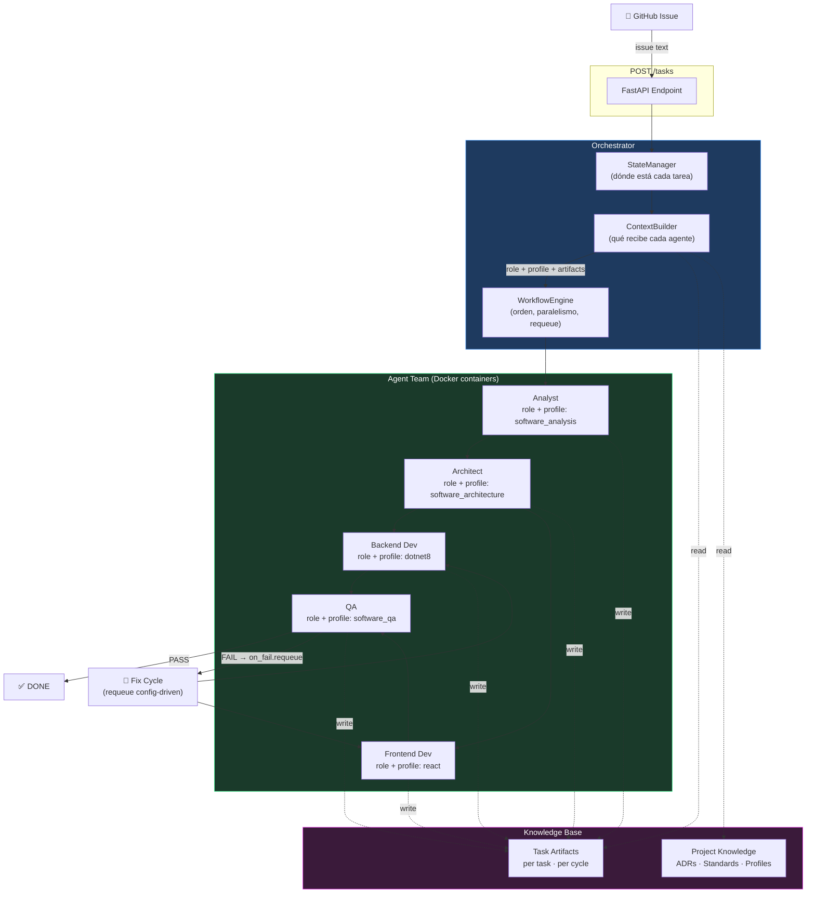
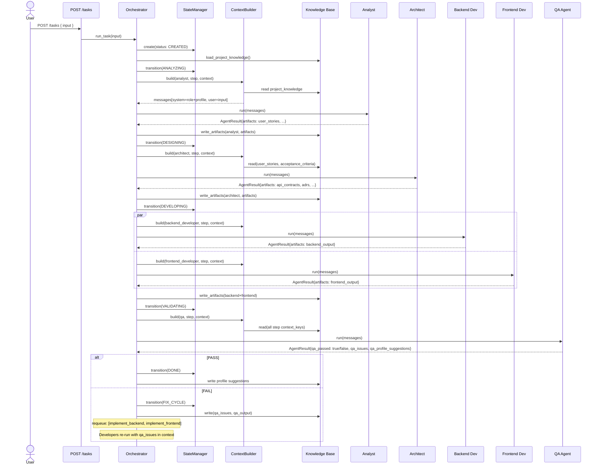
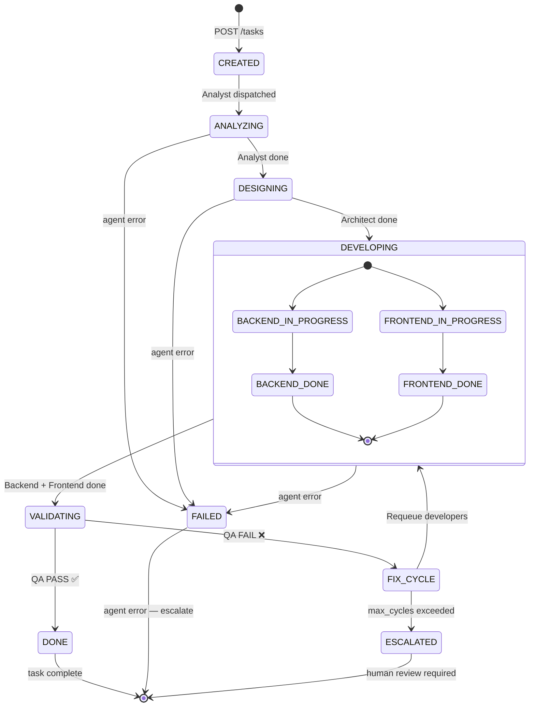
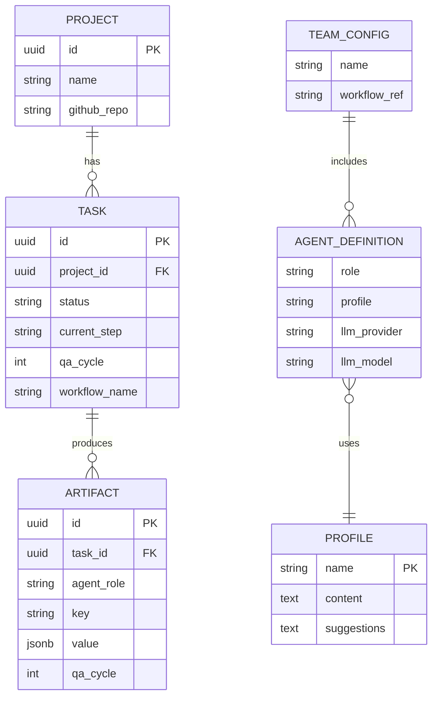

# Agentic Factory

Plataforma reutilizable para orquestar equipos de agentes AI en proyectos de software.
Los equipos se definen por configuración YAML — no se modifica código para crear un nuevo equipo.

---

## Tabla de contenidos

1. [Visión general](#visión-general)
2. [Arquitectura del sistema](#arquitectura-del-sistema)
3. [Modelo conceptual](#modelo-conceptual)
4. [Componentes del MVP](#componentes-del-mvp)
5. [Flujo de ejecución](#flujo-de-ejecución)
6. [Retroalimentación de perfiles](#retroalimentación-de-perfiles)
7. [Estructura del repositorio](#estructura-del-repositorio)
8. [Configuración de equipos](#configuración-de-equipos)
9. [Profiles disponibles](#profiles-disponibles)
10. [Inicio rápido](#inicio-rápido)
11. [Agregar un nuevo equipo](#agregar-un-nuevo-equipo)
12. [Agregar un nuevo proveedor LLM](#agregar-un-nuevo-proveedor-llm)
13. [Decisiones de arquitectura](#decisiones-de-arquitectura)

---

## Visión general

**Agentic Factory** orquesta un equipo de agentes AI — cada uno con un rol y un perfil especializado —
que colaboran para resolver tareas de desarrollo de software de extremo a extremo.

Principios del MVP:

| Principio | Descripción |
|-----------|-------------|
| **Config-driven** | Equipos, perfiles, LLMs y flujos definidos en YAML. Cero código para un equipo nuevo. |
| **LLM-agnóstico** | Anthropic, OpenAI, Ollama y Gemini son intercambiables por config. |
| **Profile separado del Role** | El rol define el comportamiento; el profile define el dominio de conocimiento. Un mismo rol puede tener distintos profiles entre equipos. |
| **ContextBuilder explícito** | Cada agente recibe exactamente los artefactos que necesita — no el diccionario completo. |
| **KB en dos capas** | Conocimiento permanente del proyecto separado de artefactos generados por tarea. |
| **Perfiles vivos** | QA etiqueta issues por profile responsable. Las sugerencias se acumulan para revisión humana. |

---

## Arquitectura del sistema

### Flujo principal



### Secuencia de ejecución



### Máquina de estados



### Modelo de datos (Knowledge Base)



---

## Modelo conceptual

```
Agent
 ├── Role        → define el comportamiento y output esperado
 ├── Profile     → conocimiento especializado del dominio (archivo .md externo)
 └── LLM         → proveedor + modelo que ejecuta el razonamiento

Team
 ├── Agents[]    → lista de (Role + Profile + LLM)
 └── Workflow    → referencia a un workflow reutilizable

Workflow
 ├── Steps[]     → agent_role + mode (sequential|parallel)
 ├── Dependencies → depends_on[] por step (grafo DAG)
 ├── Conditions  → vocabulario cerrado: eq | neq | contains | is_set
 └── Policies    → retry_max por step + on_fail.requeue + on_fail.max_cycles

ContextBuilder
 └── Por cada step: role_instructions + profile_content + filtered_artifacts

StateManager
 └── TaskState por task_id: status + current_step + qa_cycle

Knowledge Base
 ├── Project Knowledge  → guidelines/, profiles/ (permanente, por proyecto)
 └── Task Artifacts     → Redis (efímero, por tarea y ciclo QA)
```

**Relación Role → Profile:**

El mismo `role: backend_developer` puede tener `profile: dotnet8` en un equipo
y `profile: java21` en otro. El agente base es el mismo; lo que cambia es el
conocimiento especializado inyectado por el ContextBuilder.

---

## Componentes del MVP

| Componente | Archivo | Responsabilidad |
|---|---|---|
| **Orchestrator** | `orchestrator/orchestrator.py` | Coordinador central. Carga team, construye contexto, ejecuta engine, actualiza estado |
| **WorkflowEngine** | `orchestrator/core/workflow_engine.py` | Ejecuta grafo de steps. Domain-agnóstico — no conoce roles específicos |
| **ContextBuilder** | `orchestrator/core/context_builder.py` | Construye `list[Message]` para cada agente: role + profile + artifacts filtrados |
| **StateManager** | `orchestrator/core/state_manager.py` | Persistencia de `TaskState`. Redis o in-memory |
| **ProfileLoader** | `orchestrator/core/profile_loader.py` | Carga `profiles/*.md`. Cache con `lru_cache`. Escribe `.suggestions.md` |
| **ConfigLoader** | `orchestrator/core/config_loader.py` | Parsea YAML de teams y workflows a domain models |
| **LLM Adapters** | `orchestrator/llm/` | Anthropic, OpenAI, Ollama, Gemini. Contrato: `complete()` + `stream()` |
| **BaseAgent** | `agents/base/agent.py` | LLM caller + output parser. Recibe messages pre-construidos |
| **Role Agents** | `agents/*/agent.py` | Solo definen `ROLE_INSTRUCTIONS` y `_parse_output()` |
| **KnowledgeBase** | `knowledge_base/store.py` | Dos capas: `load_project_knowledge()` + `write/read_artifacts()` |
| **API** | `orchestrator/api/main.py` | FastAPI: `POST /tasks`, `GET /tasks/{id}`, `GET /health` |

---

## Flujo de ejecución

```
POST /tasks { "input": "...", "project_id": "..." }
  │
  ├─► Orchestrator.run_task()
  │     ├─► StateManager.create(CREATED)
  │     ├─► KnowledgeBase.load_project_knowledge()
  │     └─► WorkflowEngine.execute(workflow, context)
  │           │
  │           ├─[step: analyze_requirements]──────────────────────────────┐
  │           │   ContextBuilder.build(analyst, step, context)            │
  │           │     system = ROLE_INSTRUCTIONS + profile/software_analysis │
  │           │     user   = task_input + project_knowledge               │
  │           │   AnalystAgent.run(messages) → artifacts → KB             │
  │           │                                                           │
  │           ├─[step: design_architecture]──────────────────────────────┤
  │           │   ContextBuilder filtra: user_stories, acceptance_criteria │
  │           │   ArchitectAgent.run(messages) → api_contracts, adrs → KB │
  │           │                                                           │
  │           ├─[parallel: implement_backend + implement_frontend]────────┤
  │           │   Cada uno recibe solo sus context_keys del workflow YAML  │
  │           │   backend_developer recibe: api_contracts + data_model     │
  │           │   frontend_developer recibe: api_contracts + component_tree│
  │           │                                                           │
  │           └─[step: validate]──────────────────────────────────────────┘
  │               QAAgent recibe todos los outputs previos
  │               qa_passed = True  → WorkflowRun.status = done
  │               qa_passed = False → on_fail.requeue triggers
  │                 → implement_backend y implement_frontend re-encolados
  │                 → context.task_artifacts ya tiene qa_issues y qa_output
  │                 → ciclo 2 comienza con feedback explícito
  │
  └─► StateManager.transition(DONE | FAILED | ESCALATED)
      Orchestrator._flush_profile_suggestions()
        → profiles/*.suggestions.md actualizado
```

---

## Retroalimentación de perfiles

Los perfiles mejoran con el uso. El mecanismo tiene tres partes:

### 1 — QA etiqueta issues por profile responsable

```
## Issues Found
- [HIGH] Missing migration Down() method | agent: backend_developer | profile: dotnet8
- [MEDIUM] Button not keyboard accessible | agent: frontend_developer | profile: react

## Profile Improvement Suggestions
- profile: dotnet8 | section: Entity Framework Core Standards | suggestion: Require Down() in every migration
- profile: react | section: Accessibility Standards | suggestion: All buttons must have explicit type attribute
```

### 2 — El Orchestrator escribe las sugerencias automáticamente

Al finalizar cada tarea (PASS o ESCALATED), el Orchestrator llama a `ProfileLoader.append_suggestion()`.
Las sugerencias se acumulan en `profiles/<name>.suggestions.md`.

### 3 — Revisión humana y merge al profile activo

```
profiles/
├── dotnet8.md                  ← profile activo (leído por ContextBuilder)
└── dotnet8.suggestions.md      ← sugerencias pendientes de aprobación
```

Cuando una sugerencia se aprueba, se copia al profile activo.
La próxima tarea que use ese profile ya se beneficia del conocimiento nuevo.

---

## Estructura del repositorio

```
agentic_factory/
│
├── orchestrator/
│   ├── __init__.py
│   ├── orchestrator.py             # Coordinador central
│   ├── Dockerfile
│   ├── llm/
│   │   ├── base.py                 # LLMProvider ABC: complete() + stream()
│   │   ├── factory.py              # @register + build(config)
│   │   ├── anthropic_adapter.py
│   │   ├── openai_adapter.py
│   │   ├── ollama_adapter.py
│   │   ├── gemini_adapter.py
│   └── claude_code_adapter.py      # CLI claude -p — sin API key, sesión OAuth local
│   ├── core/
│   │   ├── models.py               # Domain models: Agent, Team, Workflow, Task...
│   │   ├── context_builder.py      # Construye messages para cada agente
│   │   ├── workflow_engine.py      # Ejecuta DAG de steps — domain-agnóstico
│   │   ├── state_manager.py        # Persiste TaskState (Redis / in-memory)
│   │   ├── config_loader.py        # YAML → domain models
│   │   └── profile_loader.py       # Carga profiles/*.md + escribe suggestions
│   └── api/
│       └── main.py                 # FastAPI: POST /tasks, GET /tasks/{id}
│
├── agents/
│   ├── base/
│   │   ├── agent.py                # BaseAgent: run(messages) → AgentResult
│   │   └── Dockerfile.base
│   ├── analyst/agent.py            # ROLE_INSTRUCTIONS + _parse_output
│   ├── architect/agent.py
│   ├── backend_dev/agent.py
│   ├── frontend_dev/agent.py
│   └── qa/agent.py                 # + profile suggestion extraction
│
├── profiles/                       # Conocimiento especializado (archivos .md)
│   ├── software_analysis.md
│   ├── software_architecture.md
│   ├── dotnet8.md
│   ├── react.md
│   └── software_qa.md
│
├── knowledge_base/
│   └── store.py                    # load_project_knowledge() + write/read_artifacts()
│
├── workflows/
│   ├── software_development.yaml   # Flujo completo: analyst→architect→backend+frontend→qa
│   └── analysis_only.yaml          # Solo analyst + architect (análisis y diseño)
│
├── teams/
│   ├── dotnet-react-migration.yaml # Caso inicial: .NET MVC 5 → .NET 8 + React
│   └── default_team.yaml
│
├── guidelines/                     # Lineamientos vivos del proyecto
│   ├── decisions/                  # ADRs
│   ├── standards/
│   ├── workflows/
│   └── agents/
│
├── architecture/                   # Diagramas Mermaid
│   ├── 01_workflow_main.mmd
│   ├── 02_sequence_task.mmd
│   ├── 03_deployment_docker.mmd
│   ├── 04_state_machine.mmd
│   └── 05_knowledge_base.mmd
│
├── docker-compose.yml
├── requirements.txt
└── .env.example
```

---

## Configuración de equipos

### Schema del team YAML

```yaml
team:
  name: my-team-name
  description: Optional description

agents:
  - role: analyst                   # Debe coincidir con AGENT_REGISTRY en orchestrator.py
    profile: software_analysis      # Nombre del archivo en profiles/<name>.md
    llm:
      provider: anthropic           # anthropic | openai | ollama | gemini
      model: claude-sonnet-4-6
      temperature: 0.4
      max_tokens: 4096

  - role: backend_developer
    profile: dotnet8                # Perfil especializado para este equipo
    llm:
      provider: anthropic
      model: claude-sonnet-4-6
      temperature: 0.2

workflow: software_development      # Referencia a workflows/<name>.yaml
```

### Schema del workflow YAML

```yaml
name: software_development

steps:
  - name: analyze_requirements
    agent_role: analyst
    mode: sequential                # sequential | parallel
    depends_on: []
    retry_max: 2
    context_keys: []                # [] = solo input + project_knowledge

  - name: validate
    agent_role: qa
    mode: sequential
    depends_on: [implement_backend, implement_frontend]
    context_keys:
      - user_stories
      - backend_output
      - frontend_output
      - qa_output                   # ciclo anterior si aplica
    on_fail:
      requeue: [implement_backend, implement_frontend]
      max_cycles: 3
```

---

## Profiles disponibles

| Profile | Archivo | Uso |
|---------|---------|-----|
| `software_analysis` | `profiles/software_analysis.md` | Analyst en cualquier equipo |
| `software_architecture` | `profiles/software_architecture.md` | Architect en cualquier equipo |
| `dotnet8` | `profiles/dotnet8.md` | Backend Developer .NET 8 + EF Core + ASP.NET Core |
| `react` | `profiles/react.md` | Frontend Developer React 18 + TypeScript + Vite |
| `software_qa` | `profiles/software_qa.md` | QA en cualquier equipo |

Para crear un nuevo profile: agregar `profiles/<nombre>.md` con el conocimiento especializado.
No se modifica ningún archivo de código.

---

## Inicio rápido

### 1. Variables de entorno

```bash
cp .env.example .env
# Editar con tus valores
```

Ejemplo con `claude_code` (sin API key de Anthropic):

```env
GH_TOKEN=ghp_xxxxxxxxxxxx          # Personal Access Token con scopes: repo, project
TEAM_CONFIG=dotnet-react-migration
LOG_LEVEL=INFO
CLAUDE_BIN=/root/.npm-global/bin/claude
CLAUDE_CONFIG_DIR=~/.claude-personal
CLAUDE_ADD_DIRS=/home/apps/web/react/web.agro.nt   # directorios accesibles por agentes
CLAUDE_TIMEOUT=600
```

### 2. Levantar Redis y el orquestador

```bash
# Redis en Docker
docker compose up redis -d

# Orquestador en host (requerido con claude_code — OAuth no funciona dentro de Docker)
source .env && export $(grep -v '^#' .env | xargs)
nohup python3 -m uvicorn orchestrator.api.main:app --host 0.0.0.0 --port 8000 \
  > /tmp/orchestrator.log 2>&1 &

# Ver logs en tiempo real
tail -f /tmp/orchestrator.log
```

> **Nota:** Con proveedores cloud (Anthropic/OpenAI) el stack completo puede correr en Docker.
> Con `claude_code` el orquestador debe correr en el host porque el token OAuth está ligado a la sesión local.

### 3. Enviar una tarea desde texto libre (async)

```bash
curl -X POST http://localhost:8000/tasks \
  -H "Content-Type: application/json" \
  -d '{
    "project_id": "migration-001",
    "input": "Migrate the user authentication module from .NET MVC 5 to .NET 8 + React"
  }'
# → { "task_id": "...", "status": "created" }
```

### 4. Enviar desde un GitHub Issue

```bash
curl -X POST http://localhost:8000/tasks/sync \
  -H "Content-Type: application/json" \
  -d '{
    "github_issue": { "repo": "owner/repo", "number": 12 },
    "workflow": "analysis_only",
    "project_id": "my-project"
  }'
```

Campos opcionales de la request:

| Campo | Descripción |
|-------|-------------|
| `input` | Texto libre de la tarea |
| `github_issue` | `{ "repo": "owner/repo", "number": N }` — fetcha el issue automáticamente |
| `workflow` | Override del workflow (ej. `analysis_only`, `software_development`) |
| `team` | Override del equipo (ej. `dotnet-react-migration`) |
| `project_id` | Identificador del proyecto |
| `task_id` | ID custom (se genera UUID si se omite) |

Al completar, el orquestador:
- Postea un comentario corto en el issue (`✅ Completado por agentes (analyst, architect).`)
- Mueve la tarjeta a **Done** en el GitHub Project asociado (requiere scope `project` en el token)

### 5. Consultar estado

```bash
curl http://localhost:8000/tasks/{task_id}
# → { "status": "validating", "current_step": "validate", "qa_cycle": 1 }
```

---

## Agregar un nuevo equipo

**Sin tocar código.** Solo agregar archivos:

1. Crear los profiles que no existan en `profiles/`:
   ```
   profiles/java21.md
   profiles/angular.md
   ```

2. Crear el team YAML:
   ```yaml
   # teams/java-angular.yaml
   team:
     name: java-angular

   agents:
     - role: backend_developer
       profile: java21
       llm: { provider: anthropic, model: claude-sonnet-4-6, temperature: 0.2 }

     - role: frontend_developer
       profile: angular
       llm: { provider: anthropic, model: claude-sonnet-4-6, temperature: 0.2 }
     # ... resto de agentes

   workflow: software_development   # mismo workflow
   ```

3. Iniciar con el nuevo equipo:
   ```bash
   TEAM_CONFIG=java-angular docker compose up
   ```

---

## Agregar un nuevo proveedor LLM

1. Crear `orchestrator/llm/mi_proveedor_adapter.py`:

```python
from .base import LLMConfig, LLMProvider, LLMResponse, Message
from .factory import register

@register("mi_proveedor")
class MiProveedorLLM(LLMProvider):
    async def complete(self, messages: list[Message]) -> LLMResponse:
        # llamar SDK
        return LLMResponse(content=..., provider="mi_proveedor", model=self.config.model)

    async def stream(self, messages: list[Message]):
        yield "..."
```

2. Importarlo en `factory.py` → `_load_adapters()`.

3. Usarlo en cualquier team YAML: `provider: mi_proveedor`.

### Proveedor `claude_code` (sin API key)

Usa el CLI `claude -p` con la sesión activa de Claude Code. No requiere `ANTHROPIC_API_KEY`.

```yaml
# teams/dotnet-react-migration.yaml
agents:
  - role: analyst
    profile: software_analysis
    llm:
      provider: claude_code
      model: sonnet        # alias: sonnet | opus | haiku
```

Variables de entorno:

| Variable | Default | Descripción |
|----------|---------|-------------|
| `CLAUDE_BIN` | `claude` | Path al binario (ej. `/root/.npm-global/bin/claude`) |
| `CLAUDE_CONFIG_DIR` | — | Sesión a usar (ej. `~/.claude-personal`, `~/.claude-work`) |
| `CLAUDE_ADD_DIRS` | — | Directorios extra accesibles por el subprocess, separados por `:` |
| `CLAUDE_TIMEOUT` | `600` | Timeout en segundos para cada llamada al CLI |

---

## Decisiones de arquitectura

| ADR | Decisión |
|-----|----------|
| [ADR-001](guidelines/decisions/ADR-001-llm-abstraction.md) | Adapter pattern para LLM — cambio de proveedor sin modificar agentes |
| [ADR-002](guidelines/decisions/ADR-002-docker-per-agent.md) | Un container por agente — aislamiento e independencia |
| [ADR-003](guidelines/decisions/ADR-003-profile-separation.md) | Profile como archivo .md externo — conocimiento especializado sin cambio de código |
| [ADR-004](guidelines/decisions/ADR-004-workflow-driven-requeue.md) | Ciclo QA/fix config-driven — WorkflowEngine no conoce roles de dominio |
| [ADR-005](guidelines/decisions/ADR-005-context-builder.md) | ContextBuilder como componente explícito — cada agente recibe solo lo que necesita |

---

## Stack tecnológico

| Capa | Tecnología |
|------|-----------|
| Lenguaje | Python 3.12 |
| API | FastAPI + Uvicorn |
| LLM | Anthropic SDK · OpenAI SDK · httpx (Ollama) · Google GenAI |
| State + Artifacts | Redis (asyncio) |
| Config | YAML |
| Profiles | Markdown (archivos .md) |
| Containers | Docker + Docker Compose |
| Diagramas | Mermaid |

---

## Fase 2 (fuera de scope del MVP)

| Feature | Descripción |
|---------|-------------|
| `Skills` | Capacidades específicas por agente (code_review, test_generation) |
| `Tools` | Function calling: GitHub API, linter, compilador, buscador de docs |
| GitHub Webhook | Trigger automático desde Issues/PRs |
| GitHub PR creation | Cierre automático del ciclo con PR |
| ProfileCurator Agent | LLM que analiza sugerencias y propone mejoras estructuradas al profile |
| Vector KB | Búsqueda semántica en artefactos históricos |
| Observabilidad | Trazas por tarea, métricas de tokens, latencia por agente |
| Agent containers isolados | Comunicación via Redis Pub/Sub (actualmente in-process) |
